# Introduccion a los lenguajes de programación.

## ¿Qué es un programa y programación?
### ¿Qué es un programa?
Un programa es un conjunto de instrucciones o algoritmos diseñados para ser interpretadas y ejecutadas por una computadora.

Aunque se suele usar el término software como sinónimo, la realidad es que un programa es solo una parte del software, y este a su vez está compuesto no sólo por programas, sino por bases de datos y otro tipo de archivos.

### ¿Qué es programación?

Un **programa de computadora** es una secuencia de instrucciones, escritas
para realizar una tarea específica en una computadora.

El **código fuente de un programa** informático es un conjunto de líneas de texto
con los pasos que debe seguir la computadora para ejecutar dicho programa.

```c++
#include <iostream>
int main(int argc, char *argv[]){
    std::cout<<"Hola Mundo"<<std::endl;
    return 0;
}
```

## Clásificacion de los lenguajes acuerdo con su nivel de abstracción.
## Lenguajes compilados e interpretados.

El código fuente de un programa debe ser implementado en un lenguaje de programación. Éste puede ser **interpretado** o **compilado**.


|Compilado|Intepretado|
|---------|-----------|
|Traducido por un compilador y convertido en ejecutable.|Ejecutado línea a línea por un intérprete.|
|Tipado estático.|Permite tipado dinámico.|
|Dependiente de la plataforma.|Independiente de la plataforma.|
|Ejecución relativamente rápida.|Ejecución relativamente lenta.|
<div>
<p>


</p>
</div>
<br>
<br>
<br>
<br>
<br>
<br>

> El lenguaje de programación Python es un lenguaje interpretado mientras que C/C++ es compilado.


### Diseño de un programa.

Un **algoritmo** es un conjunto prescrito de instrucciones o reglas bien definidas,ordenadas y finitas que permite llevar a cabo una actividad.

Un **diagrama de flujo** es la representación gráfica de un algoritmo o proceso.

El **pseudocódigo** es una descripción de alto nivel compacta e informal del principio operativo de un programa informático u otro algoritmo.


### Diagramas de Flujo y Pseudocódigo.


<div align="center">


<p>
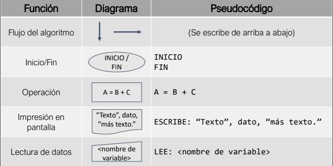
</p>
<br>
<p>
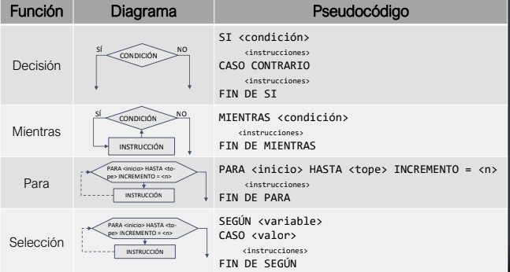
</p>
</div>

#### Ejercicios con diagramas de flujo.
 Las soluciones se encuentran en la carpeta *soluciones*.
Hacer los siguientes diagramas de flujo según el problema planteado.

1. Suma de dos números enteros.
2. Mayoría de edad (suponiendo que son 18 años).
3. Temporizador.
## Paradigmas de programación.

Los paradigmas de programación son modelos para resolver problemas. Se divide en 3.

1. La programación estructurada.

    Da claridad, calidad y tiempo de desarrollo.
2. La programación Orientada a Objetos.
    Se centra en crear objetos que tienen relación con la realidad.
3. La programación funcional.
    Uso de recursividad y además creación de funciones de alto nivel.
# Introducción al lenguaje C.

## Un poco de historia.
* A finales de los sesenta, Dennis Ritchie y Ken Thompson implementan el sistema operativo Unix para una computadora PDP-7 y posteriormente lo adaptan a una computadora PDP-11.

* En 1972, Ritchie desarrolla un nuevo lenguaje de programación por el deseo
de Thompson de crear utilidades para la PDP-11. Como se basa principalmente en el lenguaje B, nombra a su nuevo lenguaje C.

* En 1973, el kernel de Unix se empezó a reimplementar en C, convirtiéndose en uno de los primeros en ser implementados en un lenguaje diferente a
ensamblador.

<div>
<p align = "left">

</p>
<p align = "right">

</p>
</div>
<br>
<br>
<br>
<br>
<br>
<br>


> Imagen tomada de [Wikipedia](https://es.wikipedia.org/wiki/Dennis_Ritchie#/media/Archivo:Dennis_Ritchie_2011.jpg) e igualmente [Ken Thompson y Dennis Ritchie](https://es.wikipedia.org/wiki/Dennis_Ritchie#/media/Archivo:Ken_Thompson_and_Dennis_Ritchie--1973.jpg) 


* En 1977, Ritchie y Stephen C. Johnson hacen cambios
a C para hacerlo más portátil, lo cual a su vez lo hizo
más popular.
* En 1978, se publica la primera edición de The C Programming Language.

* Durante los años setenta y ochenta, se crean varias
versiones del lenguaje C.
* En 1989, se crea un estándar internacional para el
lenguaje llamado ANSI C, ISO C o C89 basado en la
segunda edición de The C Programming Language.

<div>
<p align = "left">
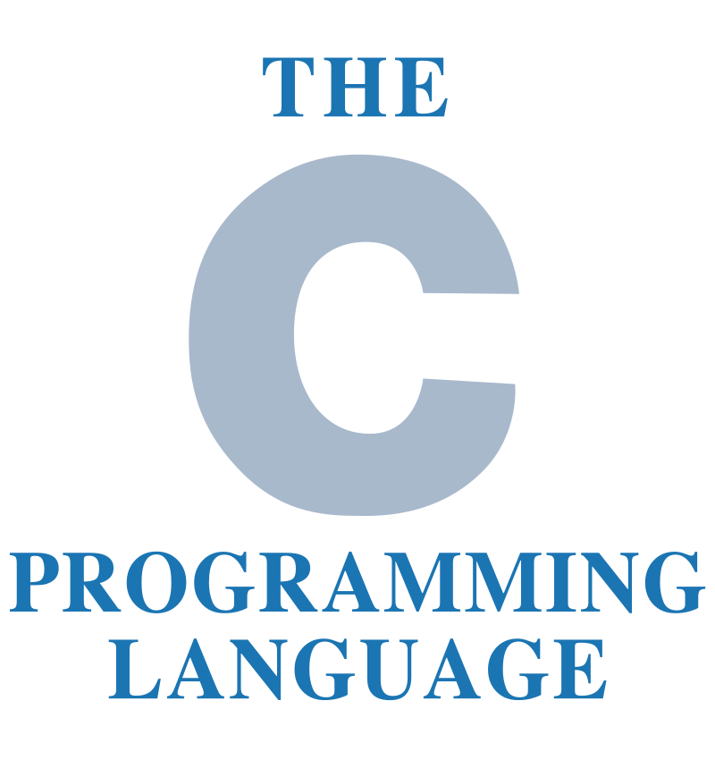
</p>
<p align  = "right">
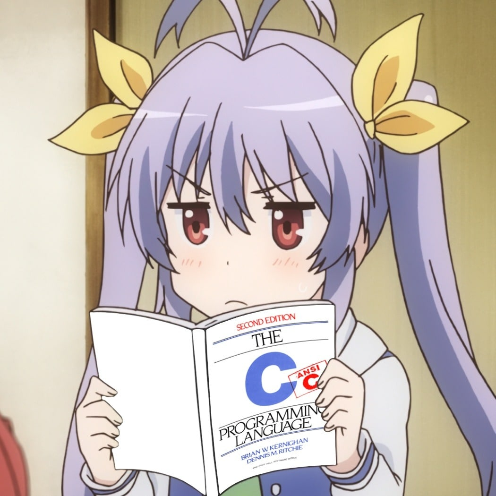
</p>

</div>
<br>

> Imagen del libro [THE C PROGRAMMING LANGUAGE](https://upload.wikimedia.org/wikipedia/commons/thumb/3/35/The_C_Programming_Language_logo.svg/1200px-The_C_Programming_Language_logo.svg.png) 


## ¿Qué es el lenguaje C?

C es un lenguaje de programación:

* Compilado.
* Imperativo.
* Estructurado.
* De tipado estático y débil.
* De alto nivel.
* Orientado (pero no limitado) a la implementación de sistemas operativos.

## Versiones del lenguaje C.
* **C estándar: ANSI C, ISO C o C89** garantiza funcionar en todos lados.
* **C99** agrega nuevos tipos de dato y soporte para caracteres Unicode.
* **C11** incrementa la compatibilidad con C++, entre otras cosas.
* **C18** corrige errores y defectos de C11.
* **C2x** aún no se crea. Se espera que inicie en 2023.
## ANSI C.
ANSI C es un estándar publicado por el **Instituto Nacional Estadounidense de Estándares (ANSI)**, para el lenguaje de programación C. Se recomienda a los desarrolladores de software en C que cumplan con los requisitos descritos en el documento para facilitar así la portabilidad del código. [Wikipedia](https://es.wikipedia.org/wiki/ANSI_C)
### Usos actuales de C.
* Desarrollo de nuevas versiones del Sistema operativo Linux.

* Desarrollo en aplicaciones de Windows.
* También en macOS.
* Microprocesadores.
* Fundamento y contrucción también de lenguaje Python.
* Desarrollo de Git.

### Logros del lenguaje
<p align = "center">
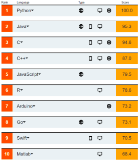
</p>

> Todos los lenguajes en esta lista basaron su sintaxis en la de C de manera directa o indirecta. La mayoría de los compiladores o intérpretes de estos lenguajes están hechos en C.

# Introducción a la programación C.
## Fases de desarrollo de un programa.

- Análisis.
- Diseño.
- Implementación.
- Pruebas.

### Análisis.
Especialmente va relacionada con la pregunta ¿Qué tiene que hacer el programa?  Requerimientos y características. 
<p align = "center">

</p>

### Diseño.
Decir y construir la estructura general del programa.
<p align = "center">

</p>

### Implementación.
Escoger una herramienta que nos facilite el trabajo.

* Identificar correctamente las variables y su alcance.

* Elegir algoritmos y estructuras de datos adecuadas para el problema.

* Mantener la lógica de la aplicación lo más 
sencilla posible.
* Documentar y comentar adecuadamente el código de los programas.
* Facilitar la interpretación visual del código utilizando reglas de formato de
código.

<p align = "center">
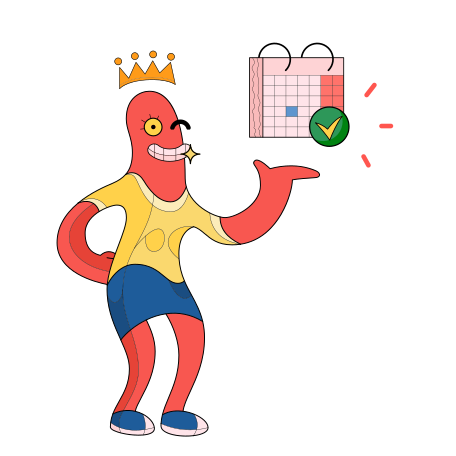
</p>

### Pruebas.
También conocido como *depuración*, en donde se detecta fallos y corregirlos.
<p align = "center">
    
</p>

## Herramienta de desarrollo.
* Compilador.
* Editor de texto.
* IDE.
* Compilador online.

<p align = "center">
    
</p>


## Instalación.
### Linux.
Algunas distribuciones de Linux ya lo tienen implementado entonces solamente falta por verificar si es así. Abrir una Terminal y teclear el siguiente comando.
```
    gcc --version
```
Si sale el siguiente mensaje (en este caso mostrará para distribución en Ubuntu).

```    
gcc (Ubuntu 9.4.0-1ubuntu1~20.04.1) 9.4.0
Copyright (C) 2019 Free Software Foundation, Inc.
This is free software; see the source for copying conditions.  There is NO
warranty; not even for MERCHANTABILITY or FITNESS FOR A PARTICULAR PURPOSE.
```
Si no apareció el mensaje entonces se realiza los siguientes pasos:

**Ubuntu o distribuciones en Debian.** 

1. Hacer las actualizaciones del equipo.
```
    sudo apt update
```
2. Instalar el paquete ```build-essential```.

```
    sudo apt install build-essential
```
3. Instalar los paquetes necesarios incluidos ```gcc```, ```g++``` y ```make```.
```
    sudo apt-get install manpages-dev
```
4. Finalmente verificamos si se instaló correctamente.
```
    gcc --version
```
Lo que tendrá que aparecer:
```    
gcc (Ubuntu 9.4.0-1ubuntu1~20.04.1) 9.4.0
Copyright (C) 2019 Free Software Foundation, Inc.
This is free software; see the source for copying conditions.  There is NO
warranty; not even for MERCHANTABILITY or FITNESS FOR A PARTICULAR PURPOSE.
```
Para las demas distribuciones se anexa los siguientes enlaces:

* [Fedora](https://developer.fedoraproject.org/tech/languages/c/c_installation.html)
* [Arch](https://linuxhint.com/install-gcc-arch-linux/)

### Windows.
Para instalar en Windows:
1. El compilador se tendrá que descargar e instalar que aquí [estará](https://sourceforge.net/projects/mingw/files/latest/download). 
2. Después de descargarlo puedes seguir este [tutorial](https://platzi.com/tutoriales/1469-algoritmos/1901-como-instalar-gcc-para-compilar-programas-en-c-desde-la-consola-en-windows/#:~:text=GCC%20(GNU%20Compiler%20Collection)%20es,la%20consola%20en%20entorno%20Windows) y para comprobar si se instaló correctamente se teclea en una CMD el comando ```gcc --version``` y aparecerá el mensaje de que se mostró al inicio de esta subsección.

### Compiladores en linea.
En el dado caso que no quiera instalar nada en el equipo puede usar el compilador en linea.
* [Onlinegdb](www.onlinegdb.com)
* [Programiz](www.programiz.com/c-programming/online-compiler/) 

## El "Hola Mundo" de C.

El "Hola Mundo" es el primer programa que se hace cuando uno aprende un lenguaje de programación nuevo. En este caso veremos que para hacer un "hola mundo" seguiremos estos pasos:

1. Abrimos el editor de textos de su preferencia (Sublinetext, Bloc de notas, etc.)

2. Generamos un nuevo archivo llamado "hola_mundo.c" es importante que tenga la extención .c ya que sabrá el compilador que se trata de un programa hecho en C y no lo tomará de otra manera.

3. El script está en la carpeta de *scripts* pero ahí está la demostración de la escritura:

    ```C
    #include <stdio.h>

    int main()
    {
        printf("Hola Mundo en C\n");
        return 0;
    }
    ```
    Para hacer comentarios en un programa en C, se pueden hacer por linea que es poniendo ``` //Esto es un comentario en una linea``` o también puede ser para varias lineas ``` /*Esto es un comentario para varias lineas*/```.

4. Compilamos el programa con el compilador ya instalado.
5. Abrimos una terminal o CMD.
6. En la terminal escribimos el siguiente comando:

    ```
    gcc hola_mundo.c -o hola 
    ```
    Lo que estamos generando con ``` -o``` es que lo pueda "traducir" a lenguaje máquina. Lo cual nos dará como salida un resultado un ejecutable *.exe* en el caso para Windows o nada más un archivo binario para Linux. El nombre de 'hola' puede cambiar a uno que nosotros queramos.
7. Ejecutamos el archivo saliente. 
    
    Para Windows nada más es dar Clic en ejecutable y se ejecutará saldrá el mensaje o tambien se puede hacer desde la CMD como:
    ```
    hola.exe
    ``` 
    Para Linux nada más en la misma temrinal se ejecuta como:
    ```bash
    ./hola
    ```

# Variables y tipos de datos primitivos.

## Variables.

<p>
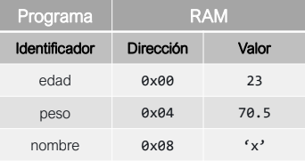
</p>

Las variables son una herramienta utilizada en la programación para almacenar y manipular datos relevantes para la ejecución de un programa.

Están conformadas por:

* Un espacio en memoria (RAM).
* Un nombre simbólico (identificador).
* Un dato o valor.

## Tipos de datos.
<p align = "center">
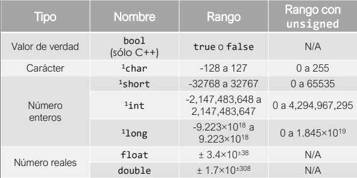
</p>

> 1. El modificador unsigned agrega el rango de los negativos a la parte positiva, permitiendo almacenar únicamente números positivos.


```c
// Este programa declara y asigna valores a variable de diferentes tipos.

#include <stdio.h>  //Incluyo biblioteca para manejo de flujos estándar.

int main() {                    //Declaro mi función main. Indica el inicio de mi código.
    char letra;                 //Declaro una variable tipo char con nombre letra.
    short enterito;             //Declaro una variable tipo short con nombre enterito.
    int entero = -2387426;      //Declaro una variable tipo int con nombre entero y guardo en ella el valor -2387426.
    long long enterote = 234629372323;      //Declaro una variable tipo long con nombre enterote y guardo en ella el valor 234629372323.
    float real = 1.9;                       //Declaro una variable tipo float con nombre real y guardo en ella el valor 1.9.
    double super_real = -0.00000000000001;  //Declaro una variable tipo double con nombre super_real y guardo en ella el valor -0.00000000000001.

    letra = 'x';        //Asigno en la variable "letra" el valor de la letra 'x'.
    enterito = 1321;    //Asigno en la variable "enterito" el valor 1321.

    return 0;           //Indico que aquí termina mi código.
}
```
> Script *1_variables.c*


# Declaración de variables.

Para **declarar (crear)** una variable en C y C++ utilizamos la siguiente sintaxis:

```
    <tipo> <identificador>;
```
Para asignar un valor a una variable en C y C++ utilizamos la siguiente sintaxis:

```
    <identificador> = <valor>;
```
Para declarar y asignar un valor a una variable en C y C++ utilizamos la siguiente sintaxis:
```
    <tipo> <identificador> = <valor>;
```
Para acceder al valor de una variable, basta con escribir su identificador.


### TIPS. 

<p aling>

</p>

* Únicamente se pueden utilizar combinaciones de letras, números y guiones bajos para nombrar variables y funciones.
* No puede haber dos variables o funciones con el mismo identificador.
* El identificador de una variable no puede ser una palabra reservada.
* Todos los identificadores de variables y funciones deberían empezar con
una letra minúscula.
* Si el identificador de una variable o función está compuesto por dos o
más palabras, éstas se deben separar con guiones_bajos.
* Los identificadores y tipos de las variables deberían ser representativos
de lo que almacenan.

Ver declaración de variables en el archivo **variables.c** en *scripts*.


```c
// Declaracion de variables
#include<stdio.h>

int main()//Declaración de la funcion main al inicio del código
{
    short enterito; //Declaracion de tipo short con el nombre de enterito.

    char letra; //Declaro la variable de tipo char con nombre de letra.
    
    int entero=-19984; // Declaro la variable de tipo entero con el nombre de entero con el valor de -19984.
    
    long long enterote = 234629372323;//Declaro una variable tipo long con nombre enterote y guardo en ella el valor 234629372323.
    
    float real = 2.85;//Declaro una variable tipo float con nombre real y guardo en ella el valor 2.85.
    
    double super_real = 4868468468561; //Declaro una variable tipo double con nombre super_real y guardo en ella el valor -0.4868468468561.

    letra = 'y'; //Asigno en la variable "letra" el valor de la letra 'y'.
    enterito = 145; //Asigno en la variable "enterito" el valor 145.

    return 0;
}

```


<br>
<br>
<br>

# Flujo estandar.
Los flujos son canales de comunicación interconectados mediante los cuales los programas pueden interactuar con su entorno durante su ejecución.
Hay tres tipos de flujos estándar:
* Entrada estándar **(stdin)**, suele ser el teclado.
* Salida estándar **(stdout)**, suele ser el monitor.
* Error estándar **(stderr)**, también suele ser el monitor.

Para leer un valor desde el teclado y almacenarlo en una variable durante la ejecución de un programa en C se utiliza la siguiente sintaxis:

```c
    scanf(“%<esp> ... %<esp>”, &<id1>,..., &<idn>);
```
Donde ```<esp>``` es un especificador de tipo y puede ser:

<p align = "center">
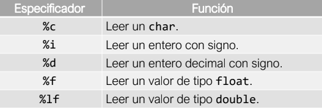
</p>

Para **imprimir el valor de una variable en pantalla** durante la ejecución de un programa en C se utiliza la siguiente sintaxis:

```c
    printf(“%<esp> ... %<esp>”, <id1>,..., <idn>);
```
Donde ```<esp>``` es un especificador de tipo y puede ser:

<p align = "center">
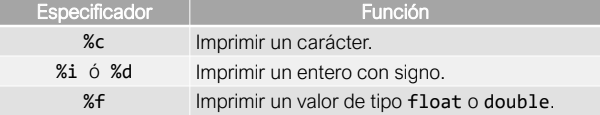
</p>


Además del especificador de tipo, la función **printf** acepta otros especificadores (por ejemplo de longitud y precisión) que ayudan a dar formato a las impresiones en pantalla.

<p align = "center">
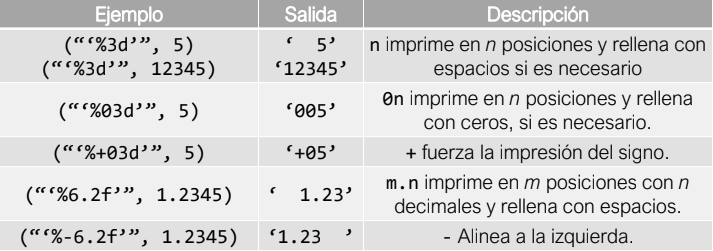
</p>

```c
/*  Este programa muestra el uso de los flujos estándar con scanf y printf para entrada y salida de datos.
    Además, muestra el uso de algunos especificadores de tipo y de formato. */

#include <stdio.h>      //Incluyo la biblioteca para manejo de flujos estándar.

int main() {            //Declaro la función main. Indica el inicio de mi código.
    char letra;                     //Declaro una variable tipo char llamada letra.
    short enterito = 13;            //Declaro una variable tipo short llamada enterito y le asigno el valor 13.
    double super_real = -0.0000001; //Declaro una variable tipo double llamada super_real y le asigno el valor -0.0000001.

    printf("Escribe una letra y presiona enter: ");     //Imprimo instrucciones para el usuario.
    scanf("%c", &letra);                                //Leo un char desde el teclado y guardo el valor en la variable "letra".
    printf("Escribe un real y presiona enter: ");       //Imprimo instrucciones para el usuario.
    scanf("%lf", &super_real);                          //Leo un double desde el teclado y guardo el valor en la variable "super_real".

    printf("La letra que ingresaste es: %c.\n", letra);     //Imprimo el char que ingresó el usuario.
    printf("El real que ingresaste es: %f.\n", super_real); //Imprimo el double que ingresó el usuario.

    //A continuación imprimo variable utilizando diferenes especificadores de formato.
    printf("El entero %5d\n", enterito);        //Imprimo la variable "enterito" utilizando 5 espacios.
    printf("El entero %+5d\n", enterito);       //Imprimo la variable "enterito" utilizando 5 espacios y forzando la impresión del signo.
    printf("El entero %+05d\n", enterito);      //Imprimo la variable "enterito" utilizando 5 espacios, forzando la impresión del signo y rellenando con ceros.
    
    printf("El real %7.2f.\n", super_real);     //Imprimo la variable "super_real" utilizando 7 espacios (dos de ellos para los decimales)
    printf("El real %+7.2f.\n", super_real);    //Imprimo la variable "super_real" utilizando 7 espacios (dos de ellos para los decimales) y forzando la impresión del signo.
    printf("El real %+-7.2f.\n", super_real);   //Imprimo la variable "super_real" empezando por la derecha, utilizando 7 espacios (2 de ellos para los decimales), forzando la impresión del signo, 


    return 0;   //Indico que aquí termina mi código.
}
```
> EyS_estandar.c


# Operadores.
Un operador es un elemento de programa que se aplica a uno o varios operandos en una expresión
o instrucción. Los operadores que requieren un operando, como el operador de incremento se conocen como operadores unarios. Es decir, es un símbolo matemático que indica que se debe llevar a cabo una operación específica sobre un cierto número de operandos.
## Asignacion.

Este tipo de operadores permiten la asiganación de un valor especifico a una variable. En C y C++ se encuentrar disponibles los siguientes operadores:

|Operador|Accion               |Ejemplo  |Resultado |
|:------:|:-------------------:|:-------:|:--------:|
|    =   |Asignación Básica    |x = 6    | x vale 6 |
|   *=   |Asignación Producto  |x *= 5   | x vale 30|
|   /=   |Asignación División  |x /= 2   | x vale 3 |
|   +=   |Asignación Suma      |x += 4   | x vale 10|
|   -=   |Asignación Resta     |x -= 1   | x vale 5 |
|   %=   |Asignación Básica    |x %= 5   | x vale 1 |
## Aritméticos.
|Operador|Accion               |Sintaxis  |
|:------:|:-------------------:|:-------:|
|    +   |Suma dos operandos   |a + b;    |
|    -   |Resta dos operandos  |a-b;   |
|    *   |Multiplica dos operandos|a * b;|
|    /   |Divide dos operandos  |a / b;|
|    %   |Obtiene el residuo de una división de enteros|a % b;| 
|   ++   |Incrementa uno al valor de un operando    |a++; ++a;|
|   --   |Decrementa uno al valor de un operando    |a--; --a;|

## Lógicos.
|Operador|Accion               |Sintaxis  |
|:------:|:-------------------:|:-------:|
|    &&  |Devuelve true sólo si a y b son true. (Conjunción lógica)  |a && b;|
|   \| \|   |Devuelve true si a o b es true. (Disyunción lógica)  |a \| \| b;   |
|    !   |Niega el valor de la variable a. (Negación lógica)|!a;|

Por ejemplo:

```c
// Este programa declara variables, obtiene sus valores y realiza operaciones con esos valores.

#include <stdio.h>  //Incluyo la biblioteca para manejo de flujos estándar.

int main() {
    float operando1;           //Declaro una variable tipo float llamada operando1.
    float operando2 = 23.5;    //Declaro una variable tipo float llamada operando2.
    float resultado_suma;      //Declaro una variable tipo float llamada resultado_suma.

    printf("Ingresa un numero: ");  //Imprimo instrucciones para el usuario.
    scanf("%f", &operando1);        //Leo un valor tipo float y lo guardo en la variable operando1.
    
    resultado_suma = operando1 + operando2; //Almaceno la suma de operando1 y operando2 en resultado_suma.

    //Imprimo el valor de cada operando y su suma, usando siempre 2 decimales.
    printf("%.2f * %.2f es %.2f.\n", operando1, operando2, resultado_suma);

    /*  Imprimo el valor de cada operando y su multiplicación, usando siempre 4 decimales.
        Nótese que la multiplicación se hace en la misma línea de la impresión. */
    printf("%.4f * %.4f es %.4f.\n", operando1, operando2, operando1*operando2);

    return 0;   //Indico que aquí termina mi código.
}
```

# Estructuras de control.

### ¿Qué es una estructura de control?

En los lenguajes de programación
estructurados, las instrucciones del
código fuente se ejecutan desde
arriba hacia abajo.

Las estructuras de control permiten
modificar el flujo de ejecución de las
instrucciones de un programa.

<p align="center">
    
</p>

## Seleccion.
De selección para elegir entre distintas posibilidades.

## Iterativas
Para repetir bloques de instrucciones.

### If.
Evalúa una condición lógica y
ejecuta el bloque de instrucciones
que tiene asociado si ésta es
verdadera.

### Else.
Se puede encadenar después
de un ***if*** para ejecutar otro bloque
de instrucciones si la condición
evaluada es falsa.

### Sintaxis de if y else en C y C++.

```c
if (/*Expresion logica a evaluar*/){
    /*Bloque de instrucciones a ejecutar si la expresión evaluada regresa true.*/

}else{
    /*Bloque de instrucciones a ejecutar si la expresión evaluada regresa false.*/
}

```


### If-else.

Permite evaluar múltiples
condiciones lógicas una tras otra y
ejecutar las instrucciones asociadas
a la primera que sea verdadera.

Después de un **if**, se pueden
encadenar tantos **else** **if** como
sea necesario.

Después del último **else** **if** puede
ir un **else** para ejecutar un bloque
de instrucciones si ninguna
condición fue verdadera.

<p align="center">
    
</p>

Sintaxis de **else if** en C y C++:

```c
if (/*primer expresión lógica a evaluar*/) {
    /*Bloque de instrucciones a ejecutar si esta expresión evaluada regresa true.*/
}
else if (/*segunda expresión lógica a evaluar*/) {
    /*Bloque de instrucciones a ejecutar si esta expresión evaluada regresa true.*/

}
//Se pueden poner tantos else if como se desee
else {

    /*Bloque de instrucciones a ejecutar si no se cumple ninguna de las expresiones anteriores.*/

}
```


## Repetición.
### Switch-case.
<p align="center">
    
</p>

**switch case**. Permite evaluar una
variable (no condicional) y ejecutar
un bloque de instrucciones de
acuerdo con su valor.

Sintaxis de **switch-case** en C y C++:

```c

switch (/*variable a evaluar*/) {
    case /*valor esperado 1*/:

    /*Bloque de instrucciones a ejecutar si la variable tiene el valor esperado 1.*/
        break;

    //Se pueden poner tantos case como sea necesario.
    case /*valor esperado n*/:

    /*Bloque de instrucciones a ejecutar si la variable tiene el valor esperado n.*/
        break;

    default:

    /*Bloque de instrucciones a ejecutar si la variable no tiene ninguno de los valores esperados.*/

}
```
### While.

<p align="center">
    
</p>

**while**. Permite repetir un bloque de
instrucciones mientras una
condición lógica sea verdadera.

Es importante que alguna de las
instrucciones del **while** cambie la
condición a falso para evitar bucles
infinitos.

Sintaxis de **while** en C y C++:

```c
while (/*expresión lógica a evaluar*/) {
    /*Bloque de instrucciones a ejecutar mientras se cumpla la expresión lógica.*/
}
```

### do-while.

<p align = "center">
    
</p>

**do while**. Permite ejecutar un bloque de instrucciones una vez y luego repetirlo mientras una condición lógica sea verdadera.

Sintaxis de **do-while** en C y C++:

```c
do {

    /*Bloque de instrucciones a ejecutar una vez y a repetir mientras se cumpla la expresión lógica.*/

} while (/*expresión lógica a evaluar*/);
```

### For.

<p align="center">
    
</p>

**for**. Permite ejecutar un bloque de instrucciones una cantidad predeterminada de
veces o con base en una secuencia de números.

Para utilizar un **for** es necesario utilizar una variable que lleve la cuenta de las iteraciones o el valor actual de la secuencia.

Sintaxis de **for** en C y C++:

```c
int i;
for (i = /*valor inicial*/;
    /*condición de valor de i*/;
    /*incremento o decremento de i (++i)*/) {
    /*Bloque de instrucciones a ejecutar para todos los valores de i que cumplen la condición*/
}
```
### Break y Continue

Existe un par de palabras reservadas que sirven para modificar el flujo normal de una estructura iterativa.
+  **break**:  Sirve para interrumpir y terminar la ejecución normal de una estructura en determinado momento.
+ **continue**: Sirve para "saltarse" la iteración actual sin romper el ciclo.

# Arreglos.

## Unidimensionales.
## Bidimensionales.

# Funciones.

## Variables globales y locales.

## Paso de parámetro por valor.

## Recursividad. 

#### Fin